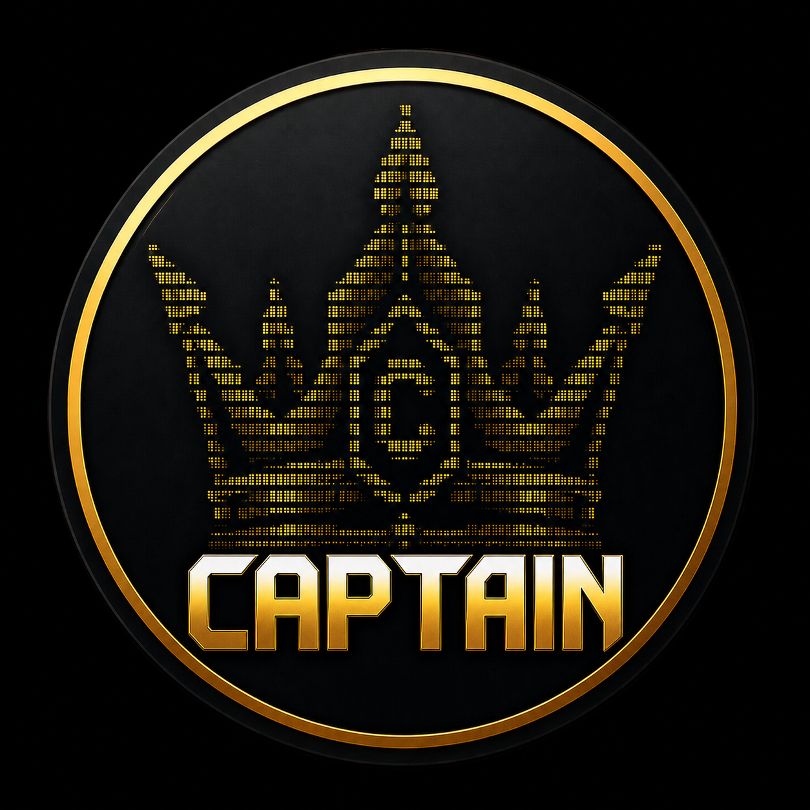

<p align="center">
  
</p>

<h1 align="center">Captain</h1>

<p align="center"><b>具备生产级纪律的自托管 Agent OS。</b></p>

<p align="center">
  <a href="https://captainagent.fr/"><b>captainagent.fr</b></a>
</p>

<p align="center">
  
  
  
</p>

<p align="center">
  <a href="README.md">English</a> ·
  <a href="README.fr.md">Français</a> ·
  <a href="README.es.md">Español</a> ·
  <b>中文</b>
</p>

**在你自己的硬件上运行的持久化 AI 操作员。** Captain 是一个 Rust
守护进程，可在会话和重启之间保留对话、项目、记忆、计划任务和智能体状态。它能够执行真实工具、委派给隔离的智能体、通过安全 API
暴露单个智能体，并在后台工作期间保持可观测。审批、预算、循环防护、checkpoint
和审计日志共同约束这种自主能力。你可以在 macOS、Linux、Windows、VPS 或 Docker
上运行 Captain，并通过终端、经过身份验证的 Control 网页应用、Telegram 或 Discord 使用它。

> **公开 Alpha：** Captain 仍在积极开发中，预发布版本之间可能包含 bug、未打磨细节和
> 不兼容变更。请保留备份、审查每项已授予的能力，并且不要将此 Alpha 用于关键工作负载。

<table>
<tr><td width="220"><b>一个二进制文件，一个守护进程</b></td><td>一个编译好的 Rust 核心负责编排智能体、工具、记忆、频道、计划任务和审批。数秒内启动，空闲时资源占用低，以原生服务（launchd/systemd）形式挺过重启，并能自我更新——在聊天中让它更新，批准即可完成。</td></tr>
<tr><td><b>持久化工作</b></td><td>项目、目标、checkpoint、workflow 和分离式工具运行都会持久化。重启后，未完成的分离式工作会以 <code>interrupted</code> 状态供检查，而不是消失或被盲目重放。</td></tr>
<tr><td><b>真实执行，受控管理</b></td><td>Shell、文件、SSH、浏览器、网络调研、代码、文档和媒体。敏感调用需要审批，关键 shell 模式会被拦截，预算限制 token、成本和调用频率。相互独立的只读工具可以并行执行，而有依赖或副作用的工作保持有序。</td></tr>
<tr><td><b>跟随对话的记忆</b></td><td>会话召回、持久化用户事实、项目状态、MemPalace、知识图谱以及可选的本地 ONNX embedding 提供有边界的上下文，而不会在每一轮重新注入全部历史。</td></tr>
<tr><td><b>任意模型，无供应商锁定</b></td><td>Codex（使用你的 ChatGPT 订阅）、Anthropic、OpenAI、Mistral、Groq、Gemini、OpenRouter，以及通过 Ollama 使用的本地模型。Captain 根据实际配置发现模型目录和凭证，不依赖固定数量。对于 Codex，Captain 每小时刷新一次目录，并在 Control 以及已配置的 Telegram 中提示新模型；只有在你明确确认并选择会话策略后才会切换。</td></tr>
<tr><td><b>六个操作中心</b></td><td>Chat, Projects, Automation, Learning, Capabilities 和 Status 是 TUI 与 Control 共用的主界面。Automation 集中管理 Workflows、Triggers、Crons、审批和 Webhooks。</td></tr>
<tr><td><b>智能体即服务</b></td><td>每个智能体都可以接收经过身份验证的外部 ingress，并发送带签名的 HTTP callback。Captain 会自动准备 ingress，并明确指出启用 egress 仍需提供的外部 callback URL。</td></tr>
<tr><td><b>像真正的软件一样可运维</b></td><td><code>captain doctor</code> 会说明哪里出了问题以及如何修复。支持快照与恢复出厂设置（始终先备份）。哈希链式审计日志。健康检查端点。安装向导最终会以一个真正运行、已验证的守护进程收尾——而不是一堆待办事项。</td></tr>
</table>

---

## 快速安装

当前公开预发布版本：
[v0.1.0-alpha.2](https://github.com/Vivien83/captain/releases/tag/v0.1.0-alpha.2)。
不可变 Docker 镜像：`ghcr.io/vivien83/captain-agent-os:v0.1.0-alpha.2`；
滚动 Alpha 通道：`ghcr.io/vivien83/captain-agent-os:alpha`。

### macOS / Linux / VPS

```bash
curl -fsSL https://github.com/Vivien83/captain/releases/download/v0.1.0-alpha.2/install.sh \
  | CAPTAIN_VERSION=v0.1.0-alpha.2 bash
```

官方仓库、Release 资产、校验和与容器镜像均为公开内容，无需 GitHub token 或容器仓库登录。

安装脚本会为你的平台下载预编译、经过校验和验证的安装包（无需编译，无需工具链），端到端验证
CLI，并运行一个引导式配置流程，**最终会让 Captain
以后台服务形式真正运行起来**。

Release 资产为 macOS 和 Linux 提供 `aarch64` 与 `x86_64`，并提供
`x86_64-pc-windows-msvc` CLI zip。每个归档都带有 SHA-256 文件和平台清单；release
还包含聚合清单以及 Unix 安装脚本。

> **Alpha 签名说明：** Release 归档和校验和会公开，但 macOS 二进制仅使用 ad-hoc
> 签名，尚未经过 Apple notarization。Windows CLI 尚未使用 Authenticode
> 签名。请核验 SHA-256 文件，并预期操作系统在首次启动时要求明确批准。

### 无界面 VPS（完全非交互式）

```bash
export ANTHROPIC_API_KEY=...       # 或任意受支持的提供商 API key
export TELEGRAM_BOT_TOKEN=...      # 可选——见下文
curl -fsSL https://github.com/Vivien83/captain/releases/download/v0.1.0-alpha.2/install.sh \
  | CAPTAIN_VERSION=v0.1.0-alpha.2 CAPTAIN_PROFILE=vps CAPTAIN_YES=1 bash
```

`vps` 配置模式会安装一个 systemd
服务，启动它，并验证其健康状态。如果检测到 Telegram token，Captain
会向 Telegram API 验证该 token，从机器人的待处理消息中识别出你的聊天，并**向你发送一条确认消息——你与智能体的第一次接触，会在安装完成几秒后出现在你的手机上。**

### 无界面 VPS，使用你的 ChatGPT 订阅（Codex，无需 API key）

Codex 是 Captain 内置的默认提供商——不需要 `ANTHROPIC_API_KEY`
之类的东西，只需要你的 ChatGPT Plus/Pro/Pro+ 登录。`CAPTAIN_START=0`
会安装好一切（二进制文件、systemd 服务），但先不启动守护进程，这样下面的就绪检查就不会在你登录之前抢先运行：

```bash
curl -fsSL https://github.com/Vivien83/captain/releases/download/v0.1.0-alpha.2/install.sh \
  | CAPTAIN_VERSION=v0.1.0-alpha.2 CAPTAIN_PROFILE=vps CAPTAIN_YES=1 CAPTAIN_START=0 bash

captain login codex        # 会显示一个 URL + 代码——在手机上打开即可，无需本地浏览器
systemctl start captain    # 非 root 安装：systemctl --user start captain
```

### Docker

公开 Alpha 在 GitHub Container Registry 提供 `linux/amd64` 和 `linux/arm64`
镜像，拉取时无需身份验证：

```bash
docker run -d --name captain --restart unless-stopped \
  -p 50051:50051 \
  -v captain-data:/root/.captain \
  -e CAPTAIN_LISTEN=0.0.0.0:50051 \
  -e MISTRAL_API_KEY \
  ghcr.io/vivien83/captain-agent-os:v0.1.0-alpha.2
```

首次启动会生成守护进程 API key，并将其与全部状态一起持久化到命名卷中，该卷可在镜像更新后继续保留。本地
embedding runtime 已在镜像中预置。

若要从源码构建或使用宿主机访问配置，请克隆仓库并使用 Compose 文件。基础服务也使用 GHCR
镜像名称，因此可以通过 `docker compose pull` 获取已发布的 release：

| 配置模式 | 对宿主机的访问权限 |
|---|---|
| *默认* | 无——仅状态卷 |
| `personal` | 桌面/文档/下载目录 + 到宿主机的 SSH |
| `trusted` | 完整 `$HOME` + Docker socket |
| `yolo` | 特权模式、宿主机网络、完整文件系统 |

```bash
git clone https://github.com/Vivien83/captain.git && cd captain
MISTRAL_API_KEY=... docker compose up -d --build

# 受控访问个人目录的示例
docker compose -f docker-compose.yml -f docker-compose.personal.yml up -d --build
```

---

## 快速上手

```bash
captain setup       # 引导式向导：提供商 → 偏好设置 → 频道 → Captain 运行起来
captain             # 完整终端界面
captain chat        # 快速终端聊天
captain doctor      # 诊断任何问题，并给出修复方案
captain update      # 自我更新（或者直接让 Captain 自己更新）
captain status      # 守护进程、智能体、频道、预算、磁盘、健康状态
```

推荐的入门提供商：

- **Codex** — `captain auth login codex`。使用你的 ChatGPT 订阅；无需管理
  API key。
- **Claude** — 在配置前导出 `ANTHROPIC_API_KEY`。

首次对话会触发一次简短的入门访谈（姓名、语言、风格、边界）——只需一次，覆盖所有界面，并被持久化存储。

经过身份验证的 Control 网页应用默认位于 `http://127.0.0.1:50051/`。它的六个操作中心与
TUI 保持一致，因此项目、自动化、能力和运行状态不会在不同界面中改变位置。专家终端仍位于
`http://127.0.0.1:50051/terminal`。

---

## 命令行 vs 即时通讯

只需运行一次守护进程；之后可以在任何地方与它对话。所有频道均**默认拒绝**：每个适配器在响应任何人之前，都需要明确的用户白名单。

| 操作 | 终端 | Telegram / Discord |
|---|---|---|
| 与 Captain 对话 | `captain chat` 或 TUI | 给机器人发消息 |
| 审批敏感操作 | TUI 审批面板 | 内联按钮 |
| 中断当前任务 | `Esc` / `Ctrl+C` | `/stop` |
| 守护进程状态 / 重启 | `captain status` / `captain service restart` | 聊天中输入 `status` / `restart` |
| 语音 | `captain voice`（本地 Whisper STT + Kokoro TTS） | 发送语音消息 |
| 更新 Captain | `captain update` | 说"更新自己" → 审批 → 完成 |

---

## 你可以让它做什么

```text
检查我的 VPS：磁盘、内存、失败的服务——修复可以安全修复的部分。
在网上调研 X，并生成一份带来源引用的 PDF 报告。
监控这个文件夹，并通过 Telegram 向我总结新增的文档。
每天早上 8 点：我的日历、天气、日志中任何异常情况。
通过 SSH 连接备份服务器，验证昨晚的任务确实执行成功了。
更新你自己。
```

底层会对内置工具进行语义选择，只有相关 schema 才会传给模型。Captain 还支持受治理的 skill、MCP
工具服务器、多智能体委派、workflow、浏览器自动化，以及可由智能体重新查看、取消或按依赖排序的持久化工具运行。

---

## 文档

| 指南 | 内容 |
|---|---|
| [Getting Started](docs/getting-started.md) | 安装 → 配置 → 第一次对话 |
| [Configuration](docs/configuration.md) | `config.toml`、提供商、模型，所有选项 |
| [CLI Reference](docs/cli-reference.md) | 所有命令与参数 |
| [Providers](docs/providers.md) | 模型提供商、身份验证、回退、路由 |
| [Channel Adapters](docs/channel-adapters.md) | Telegram、Discord、Signal、邮件配置 |
| [Security Profiles](docs/SECURITY-PROFILES.md) | 审批策略、执行模式、隔离机制 |
| [Built-in Tools](docs/captain-tools/) | 按类别划分的工具文档 |
| [Architecture](docs/architecture.md) | Crate 结构、智能体循环、内核设计 |
| [API Reference](docs/api-reference.md) | REST 端点、身份验证、流式传输 |
| [VPS Deployment](docs/deployment/github-vps-install.md) | 无界面安装、反向代理、HTTPS |
| [MCP & A2A](docs/mcp-a2a.md) | 外部工具服务器、智能体间通信 |
| [Troubleshooting](docs/troubleshooting.md) | 常见问题及其解决方法 |
| [0.1.0-alpha.2 Release Notes](docs/releases/v0.1.0-alpha.2.md) | 早期访问范围与已知限制 |
| [Docs Status (DOC2)](docs/DOCS_STATUS.md) | 当前契约、冻结界面和历史文档 |

> `docs/` 目录下的详细指南目前仅提供英文版本。

---

## 安全态势

- API 默认绑定在 `127.0.0.1`，若在公网接口上启动且未配置身份验证，会**拒绝启动**。
- 访问网页/API 需要登录会话或 bearer API key；网页配置编辑器需要身份验证。
- 敏感工具会经过审批流程；极高风险的 shell 模式会被拦截，或无论策略如何都强制要求一次性审批。
- 按智能体设置预算：token、按小时/天/月计算的成本、工具调用频率。
- 循环检测器：针对重复调用、来回摆动模式，以及连续失败的熔断机制。
- 频道白名单默认拒绝；哈希链式审计日志；密钥保存在 `secrets.env`
  或加密保险库中，绝不出现在配置文件里。

状态数据保存在 `~/.captain/` 下——`config.toml`
是唯一的可信数据源，变更后会热重载。

---

## 开发

```bash
cargo test --workspace              # 完整测试套件
cargo build --release -p captain-cli
scripts/release-readiness.sh         # 完整本地 release gate
CAPTAIN_VERSION=vX.Y.Z scripts/release-all.sh  # 本地构建全部 5 个 CLI 目标
CAPTAIN_VERSION=vX.Y.Z scripts/publish-release-local.sh
docker build --build-arg CAPTAIN_BUILD_VERSION=vX.Y.Z -t captain:vX.Y.Z .
```

`release-all.sh` 会构建两个 macOS、两个 Linux 以及 Windows CLI bundle；Windows
交叉构建使用 `cargo-xwin`、LLVM 和 NASM。完整 release gate 通过且工作树干净后，
`publish-release-local.sh` 会验证全部 20 个 asset、推送当前分支、构建并推送
`linux/amd64` + `linux/arm64` GHCR 镜像，最后发布 tag 和 GitHub Release。镜像会
直接复用两个已验证的 Linux release 二进制文件，而不是在模拟环境中重新编译
Captain。组装镜像前，发布脚本会从维护者本机的 Captain 缓存中准备一个由校验和
固定的 FastEmbed snapshot，并放入 Git 忽略的 `dist/docker/`。该缓存既不会提交
到仓库，也不会加入 20 个 release asset；Docker 构建还会再次验证它，因此无需
依赖实时可用的模型 CDN。只需运行一次 `gh auth refresh -h github.com -s read:packages,write:packages`
完成认证；不要在
命令行中传递 token。GitHub release workflow 仅作为显式手动 fallback，推送 tag
不会自动触发它。CI 仍可通过显式手动触发用于格式检查、严格 Clippy、安全与
secret 审计以及 workspace checks/tests。

---

## 许可证

采用 [MIT](LICENSE-MIT) 或 [Apache 2.0](LICENSE-APACHE) 双重许可证，可自行选择。
